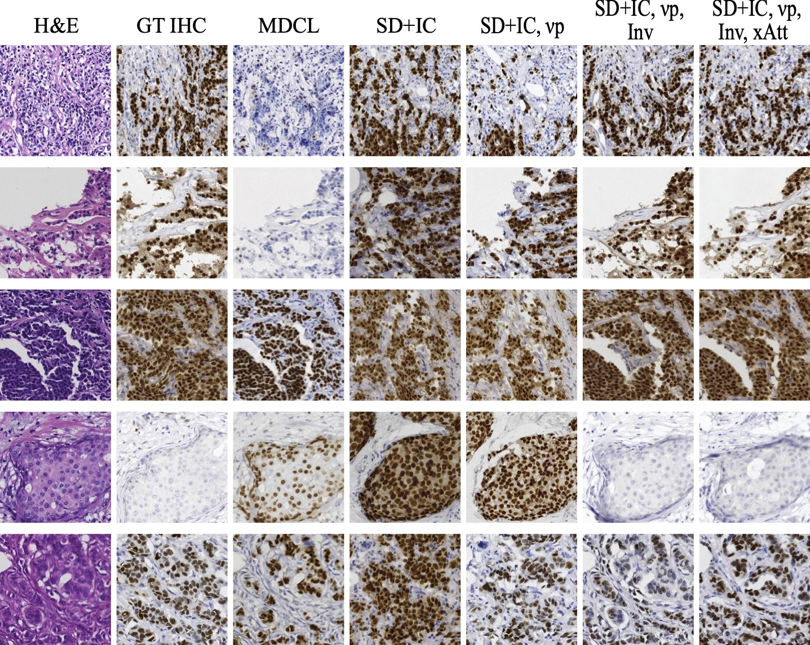
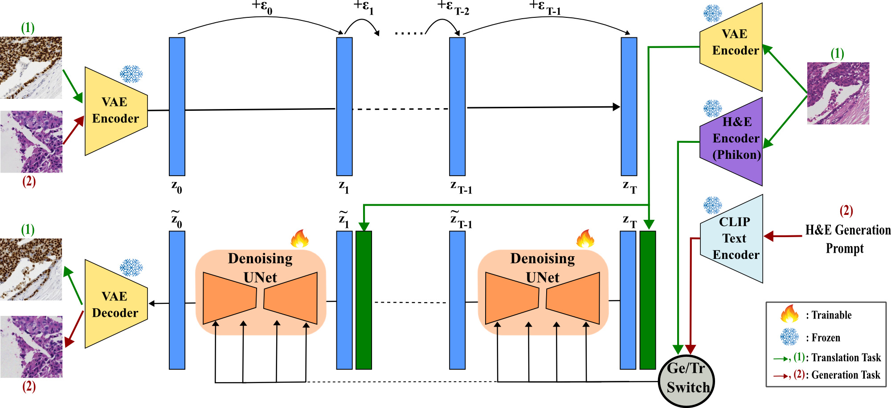
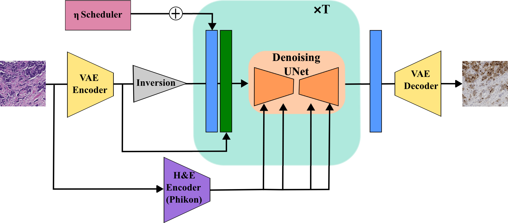

# HistDiST: Histopathological Diffusion-based Stain Transfer

Official pytorch implementation of HistDiST.
This repository contains scripts for fine-tuning pretrained Stable Diffusion models for the task of stain transfer, along with the corresponding inference script.

[Erik Großkopf](https://scholar.google.com/citations?user=5Yf0fZoAAAAJ),
[Valay Bundele](https://scholar.google.com/citations?user=xWvW9_UAAAAJ),
[Mehran Hossienzadeh](https://scholar.google.com/citations?user=V5yInfUAAAAJ), 
[Hendrik P.A. Lensch](https://scholar.google.de/citations?user=2R22h84AAAAJ)

## Abstract 
Hematoxylin and Eosin (H&E) staining is the cornerstone of histopathology but lacks molecular specificity. While Immunohistochemistry (IHC) provides molecular insights, it is costly and complex, motivating H&E-to-IHC translation as a cost-effective alternative. Existing translation methods are mainly GAN-based, often struggling with training instability and limited structural fidelity, while diffusion-based approaches remain underexplored. We propose HistDiST, a Latent Diffusion Model (LDM) based framework for high-fidelity H&E-to-IHC translation. HistDiST introduces a dual-conditioning strategy, utilizing Phikon-extracted morphological embeddings alongside VAE-encoded H&E representations to ensure pathology-relevant context and structural consistency. To overcome brightness biases, we incorporate a rescaled noise schedule, v-prediction, and trailing timesteps, enforcing a zero-SNR condition at the final timestep. During inference, DDIM inversion preserves the morphological structure, while an η-cosine noise schedule introduces controlled stochasticity, balancing structural consistency and molecular fidelity. Moreover, we propose Molecular Retrieval Accuracy (MRA), a novel pathology-aware metric leveraging GigaPath embeddings to assess molecular relevance. Extensive evaluations on MIST and BCI datasets demonstrate that HistDiST significantly outperforms existing methods, achieving a 28% improvement in MRA on the H&E-to-Ki67 translation task, highlighting its effectiveness in capturing true IHC semantics.
<p>
  
<br>

## Overview
### HistDiST training pipeline
<div align="center">
    
</div>
H&E generation (red arrows, label (2)) conditioned on CLIP text embeddings, and H&E-to-IHC translation (green arrows, label (1)) guided by Phikon embeddings and VAE-encoded H&E features. The VAE encoder maps images to latent space, where noise is added and later denoised by the U-Net. The Ge/Tr switch selects between generation and translation tasks, with each(numbered input, color-coded pathway) independently followed.

### HistDiST inference pipeline
<div align="center">
    
</div>
VAE encoder maps H&E image to latent space, where DDIM inversion derives noise latent and η-noise scheduling injects noise at different timesteps during denoising. The U-Net, conditioned on Phikon embeddings, refines the features, and the VAE decoder generates the final IHC output.

## Setup
### Models
All trained models can be downloaded from [Google Drive](https://drive.google.com/drive/folders/1onzQ05SVYCxsGMYhMis25Bsm3nwFbiyi?usp=sharing).

### Datasets
[MIST](https://github.com/lifangda01/AdaptiveSupervisedPatchNCE) and [BCI](https://github.com/bupt-ai-cz/BCI) datasets are used to finetune Stable Diffusion 1.5 for H&E to ER/HER2/Ki67/PR transfer. Images are cropped randomly from size 1024x1024 to 512x512.

### Requirements
```shell
conda install pytorch==2.1.1 torchvision==0.16.1 torchaudio==2.1.1 pytorch-cuda=11.8 -c pytorch -c nvidia 
pip install diffusers==0.16.1 
pip install transformers==4.32.1 
```

### Training
- dataset_dir 
  - Structure of MIST Dataset 
- validation_dir
  - Structure like xyz 
  - 1000 jpg images size 512x512 
  - Compute FID/SSIM/PSNR

```bash
python training/training.py \
--pretrained_model_name_or_path=botp/stable-diffusion-v1-5 \
--output_dir=training/output \
--num_train_epochs=300 \
--train_batch_size=16 \
--prediction_type=v_prediction \
--mixed_precision=bf16 \
--resolution=512
```

### Inference
```bash
python inference/inference.py --model_folder_path path/to/er_model_folder --img_path inference/example_images/er.jpg
```

### TODO
- [x] Update README
- [x] Add arguments to inferece.py script for modelpath
- [ ] Training: Resolve/Refactor imports
- [ ] Training: Compute Metrics (optional) Copy metrics folder from ASP Repo
- [ ] Requirements.txt (export from python venv)
- [ ] Validate repository instructions (Emty venv/installation/model download)
- [x] Quote ASP Paper
- [x] Quote BCI paper
- [x] Quote Diffusers library
- [x] Used Dataset links
- [x] Figures
  - [x] Examples
  - [x] Training
  - [x] Inference
- [x] Citation
- [x] Acknowledgement


### Citation
If you use this code for your research, please cite our [paper](https://arxiv.org/pdf/2505.06793).
```
@misc{grosskopf2025histdist,
  title={HistDiST: Histopathological Diffusion-based Stain Transfer}, 
  author={Erik Großkopf and Valay Bundele and Mehran Hossienzadeh and Hendrik P. A. Lensch},
  year={2025}
}
```

### Acknowledgement
We thank Fangda Li et al. for their [MIST dataset](https://github.com/lifangda01/AdaptiveSupervisedPatchNCE) we used for both training and evaluation and their [evaluation script](https://github.com/lifangda01/AdaptiveSupervisedPatchNCE/blob/master/evaluate.py) we based our evaluation implementation upon. Also we thank Liu et al. for their [BCI dataset](https://bupt-ai-cz.github.io/BCI/) we also used for both training and evaluation. We thank Filiot et al. for their pretraiend (Phikon)[https://github.com/owkin/HistoSSLscaling/] model which we used for encoding input features during the translation training. We thank Xu et al. for their pretrained (Prov-GigaPath)[https://github.com/prov-gigapath/prov-gigapath] model we used for your accuracy based metric. We thank all [hugging face diffusers](https://github.com/huggingface/diffusers) authors for their training and inference scripts we based our implementation upon.  
